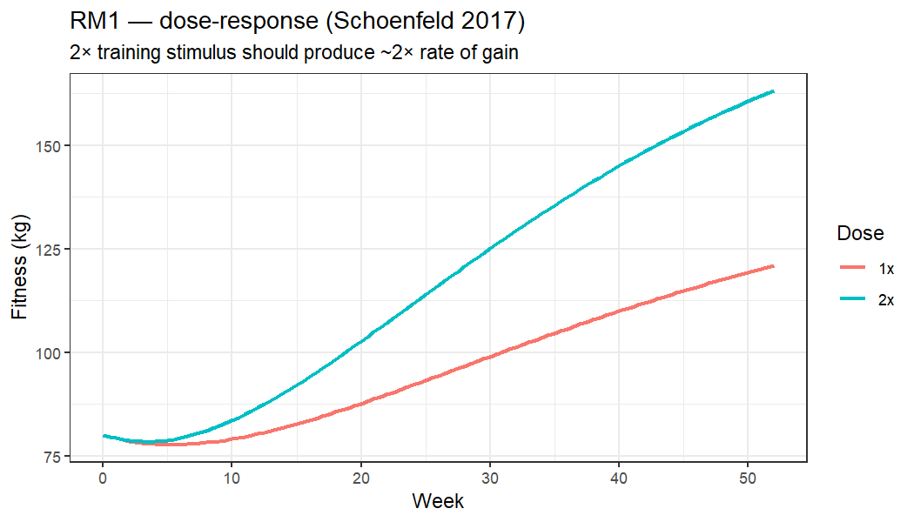

# synthesim

**An interactive fitness-fatigue model explorer for resistance training — plus the 7-test physiological-plausibility suite that gates it.**

<p align="center">
  
  <br>
  <em>RM1 (dose-response): doubling weekly training volume produces a larger steady-state Fitness gain. One of seven physiological reference modes the simulator must satisfy.</em>
</p>

[**Try it live (Shiny):** get-paid.shinyapps.io/synthesim](https://get-paid.shinyapps.io/synthesim/) · [Run locally](#run-locally) · [What's inside](#whats-inside) · [Theory](docs/theory.md) · [Citation](CITATION.cff)

---

## What is this?

`synthesim` is a deterministic forward-simulator for the **MEDv4** fitness-fatigue-signal ODE — a three-stock system-dynamics model of resistance-training adaptation, originally built in Vensim and ported to R + Python here.

Drag the sliders, change the training program, watch:

- **Fitness** (long-run adaptation) rise as you train,
- **Fatigue** (short-timescale recovery debt) accumulate and decay,
- **Signal** (the secondary mediator that gates adaptation) ride between them,
- **Performance = Fitness − α · Fatigue** trace out the predicted progression.

It ships with a **reference-mode validator** — seven forward-simulation unit tests anchored to canonical RT literature (dose-response, detraining, ADL floor, saturation, …). The validator is the structural gate before anything more ambitious gets built on top of the model.

## Why this exists

There's a long lineage of fitness-fatigue models in exercise science — Banister 1975, Calvert 1976, Busso 1991/2003, Fitz-Clarke, Morton, the PerPot family — but most live in figures, not in code you can actually run.

This repo packages one variant of that lineage so anyone can:

1. **Click through the dynamics** without compiling C++ or installing Stan.
2. **Confirm the model behaves the way the science says it should** — by re-running the seven-test validator.
3. **Adapt the simulator** to their own programming (custom periodization, RP-style mesocycles, return-from-break) using a simple event-list API.

It's an open-science explainer, packaged as a tool.

## What's inside

| Path | What it is |
|---|---|
| [`inst/shiny/synthesim/`](inst/shiny/synthesim/) | The Shiny app. Self-contained R; deployable on shinyapps.io. Live at the URL above. |
| [`python/synthesim/synthesim.py`](python/synthesim/synthesim.py) | Marimo notebook port. Same model + UI; exports to WASM so it runs in a browser with no server. |
| [`python/synthesim/sd_diagram.py`](python/synthesim/sd_diagram.py) | A Vensim-style stock-and-flow diagrammer (matplotlib). |
| [`R/med_ode.R`](R/med_ode.R) | The MEDv4 ODE right-hand side. Two variants: original (quadratic) + linear. |
| [`R/simulate.R`](R/simulate.R) | High-level simulator wrapper around `deSolve::ode`. |
| [`R/scenarios.R`](R/scenarios.R) | Composable scenario builders: weekly training, detraining, return-from-break, custom event lists. |
| [`R/training_schedule.R`](R/training_schedule.R) | Forcing-function constructors — both Vensim's `PULSE TRAIN` parameterization and arbitrary event lists. |
| [`R/reference_mode_tests.R`](R/reference_mode_tests.R) | The seven-test validator with a self-contained Euler integrator (no external solver). |
| [`tests/validate_reference_modes.R`](tests/validate_reference_modes.R) | Driver: runs the validator and writes `results.csv` + figures. |
| [`inst/vensim/MEDv4_secondary_signal.mdl`](inst/vensim/MEDv4_secondary_signal.mdl) | Read-only copy of the source Vensim model (provenance). |
| [`docs/theory.md`](docs/theory.md) | Plain-English explainer of the MEDv4 equations and what the seven reference modes test. |
| [`docs/figures/`](docs/figures/) | RM1, RM4, RM5 validator output PNGs. |
| [`Dockerfile`](Dockerfile) + [`docker-compose.yml`](docker-compose.yml) | Reproducible runtime — R 4.5.2 + Python + all deps, one image, three entrypoints (Shiny / marimo / validator). |

## Run locally

### Docker (recommended — one image, three runtimes)

Everything in one container; no host R or Python install needed.

```bash
# Build once:
docker compose build

# Pick what to run:
docker compose up shiny           # Shiny at http://localhost:3838
docker compose up marimo          # marimo editor at http://localhost:2718
docker compose run --rm validate  # Reference-mode validator (7-test gate)
```

The image is `rocker/r-ver:4.5.2` + slim apt deps + Posit Public Package Manager binaries (so R packages install in seconds, not minutes) + `marimo + numpy + matplotlib` via pip. Source is bind-mounted so edits hot-reload without rebuilding.

### Shiny (host R)

```r
# Install the runtime deps:
install.packages(c("shiny", "bslib", "ggplot2", "patchwork",
                   "dplyr", "tidyr", "deSolve", "DiagrammeR"))

# Run from this repo's root:
shiny::runApp("inst/shiny/synthesim")
```

The Shiny app is **self-contained** — `inst/shiny/synthesim/R/` carries its own copy of the simulator so the app can be deployed standalone.

### Marimo (Python, also exports to in-browser WASM)

```bash
pip install marimo numpy matplotlib

# Interactive edit mode:
python -m marimo edit python/synthesim/synthesim.py

# Read-only run mode:
python -m marimo run python/synthesim/synthesim.py

# Export a static WASM build (Pyodide; runs in any browser):
python -m marimo export html-wasm python/synthesim/synthesim.py -o build/index.html --mode run
```

### Reference-mode validator

```bash
Rscript tests/validate_reference_modes.R
```

Seven forward-simulation tests, each anchored to a citation from the RT literature. Writes `data/validation/reference_modes/results.csv` and renders illustrative PNGs. Runs in seconds; no external solver, no MCMC.

Expected output at v2 defaults: **7/7 PASS**.

## The seven reference modes (what the validator checks)

| # | Reference mode | What it tests | Citation anchor |
|---|---|---|---|
| RM1 | **Dose-response** | Doubling weekly training volume produces a larger steady-state Fitness gain (ratio > 1.3) | Schoenfeld 2017; Krieger 2010 |
| RM2 | **Diminishing returns** | Low-baseline subjects gain *more relatively* than high-baseline (relative-gain ordering) | Ahtiainen 2003; Suchomel 2016 |
| RM3 | **Ceiling** | Asymptotic Fitness under constant load (final-50wk CV < 0.05) | Bickel & Bamman 2011 |
| RM4 | **Detraining decay** | Fitness loss after training stops sits in 0.5–3 %/wk | Mujika & Padilla 2000; Bickel & Bamman 2011 |
| RM5 | **ADL floor** | With ADL, untrained Fitness floors at ≥ 85 % of baseline (vs collapse without) | Thom 2005; LeBlanc 2000 |
| RM10 | **Plateau under constant load** | After plateau, additional Fitness gain ≤ 10 % at t=200 | DeLorme 1945; Kraemer & Ratamess 2004 ACSM |
| RM11 | **Adaptive heterogeneity** | Cross-subject 5–95 % relative-gain range ≥ 0.3 (hyper-responders vs non-responders) | Hubal 2005 MSSE |

Failing any of these at sensible parameter values means the structural model is wrong, not just the calibration. The validator runs **before** any downstream work.

## Roadmap

This repo is the **deterministic explorer + structural-plausibility gate**. Companion work in progress:

- **Hierarchical Bayesian calibration** of the MEDv4 family against open RT cohort data — separate project; a peer-reviewed publication is in preparation.
- **`sdviz`** — a planned standalone Python library extracting the Vensim-style diagrammer + reference-mode dashboard plotting into a reusable visualization package for system-dynamics models.

When those land, this repo will gain a `posterior/` layer that lets the synthesim explorer ride along a calibrated parameter cloud instead of just point estimates.

## How to cite

```bibtex
@software{bowie_synthesim_2026,
  author = {Bowie, Jacob},
  title  = {synthesim: An interactive explorer for the MEDv4 fitness-fatigue model},
  year   = {2026},
  url    = {https://github.com/JacobBowie/synthesim},
  version = {0.1.0}
}
```

See [`CITATION.cff`](CITATION.cff) for the structured form.

## License

[MIT](LICENSE).

## Acknowledgements

- **MEDv4 source model:** in-lab Vensim system-dynamics build (provenance at [`inst/vensim/`](inst/vensim/)).
- **Reference-mode validation idiom:** Forrester 1961, Sterman 2000.
- **FFM lineage:** Calvert 1976, Banister 1975/1991, Busso 1991/2003.
- **Built with:** [Shiny](https://shiny.posit.co/), [marimo](https://marimo.io/), [deSolve](https://cran.r-project.org/package=deSolve), [matplotlib](https://matplotlib.org/).
